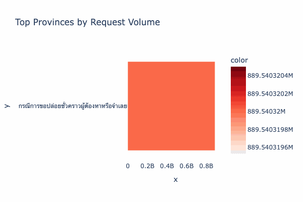
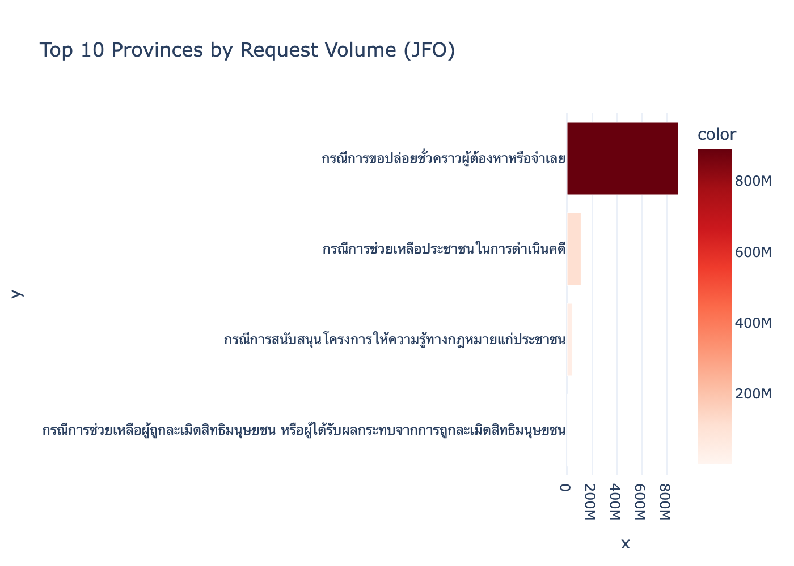
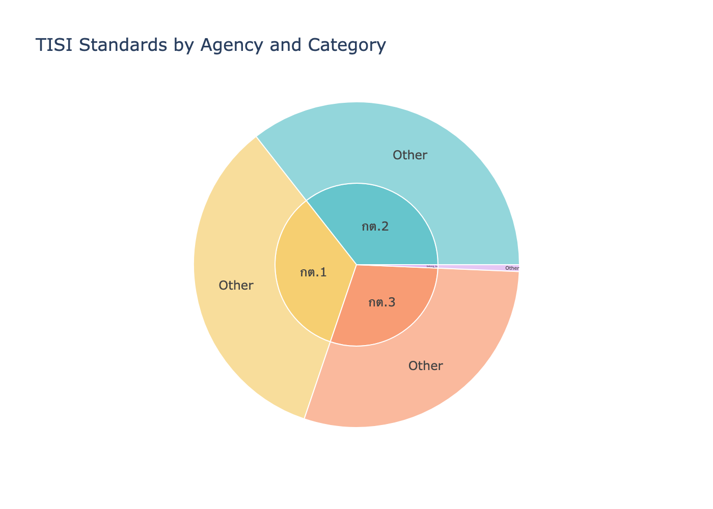

  <h1>📊 DGA รุ่นที่ 3 — กลุ่มที่ 2 และ 4</h1>
  
<strong>โครงการวิเคราะห์ข้อมูล (Data Analytics) และประยุกต์ใช้ปัญญาประดิษฐ์ (Machine Learning)</strong>

---

## 📌 ภาพรวมโครงการ (Project Overview)

Repository นี้จัดทำขึ้นภายใต้โครงการอบรม DGA รุ่นที่ 3 (กลุ่มที่ 2 และ 4) โดยประกอบไปด้วยโปรเจกต์การวิเคราะห์ข้อมูลเชิงลึกและการสร้างโมเดล Machine Learning จำนวน 2 โครงการ ได้แก่ ข้อมูลจาก **สำนักงานกองทุนยุติธรรม** และ **สำนักงานมาตรฐานผลิตภัณฑ์อุตสาหกรรม (สมอ.)**

เป้าหมายหลักของโปรเจกต์นี้คือการนำข้อมูลเปิดภาครัฐ (Open Data) มาประมวลผล สร้างภาพให้เกิดความเข้าใจง่าย (Data Visualization) และใช้ AI / สถิติขั้นสูง ในการทำนายและสกัดองค์ความรู้ใหม่ๆ

  

---

## 📂 โครงสร้างและเนื้อหาใน Repository

### ⚖️ โฟลเดอร์ `3_2` : กองทุนยุติธรรม (Justice Fund)
วิเคราะห์ข้อมูลสถิติรับคำขอตามภารกิจสำนักงานกองทุนยุติธรรม (2566–2568)
- **ข้อมูล (Dataset):** จำนวนคำขอ 15,972 รายการ จาก 77 จังหวัดทั่วประเทศ
- **📈 5 Visualizations:**
  1. **Treemap:** สัดส่วนประเภทคำขอและผลการพิจารณา
  2. **Choropleth Map:** แผนที่ประเทศไทยแสดงจำนวนคำขอรายจังหวัด
  3. **Time Series:** กราฟเส้นแนวโน้มจำนวนคำขอรายเดือน
  4. **Bar Chart:** จัดอันดับ 15 จังหวัดที่มีคำขอสูงสุด
  5. **Stacked Bar:** สัดส่วนการอนุมัติแยกตามประเภทคำขอ

  

- **🤖 3 ML Models:**
  1. **Random Forest Classifier:** ทำนายผลการพิจารณา (อนุมัติ/ไม่ผ่าน) (Accuracy ~64.4%)
  2. **K-Means Clustering:** จัดกลุ่มจังหวัด 4 กลุ่มตามพฤติกรรมการยื่นคำขอ
  3. **SARIMA Forecasting:** พยากรณ์จำนวนคำขอล่วงหน้า 12 เดือน

---

### 🏭 โฟลเดอร์ `3_4` : มอก. บังคับ (TISI Standards)
วิเคราะห์ข้อมูลรายการมาตรฐานผลิตภัณฑ์อุตสาหกรรม (มอก.) ที่เป็นมาตรฐานบังคับ
- **ข้อมูล (Dataset):** มาตรฐาน 148 ฉบับ จาก 19 หมวดหมู่ผลิตภัณฑ์
- **📈 5 Visualizations:**
  1. **Treemap:** โครงสร้างหมวดหมู่ผลิตภัณฑ์และหน่วยงานที่ดูแล
  2. **Timeline:** จำนวน มอก. บังคับที่ประกาศใช้รายปี
  3. **Horizontal Bar:** จัดอันดับจำนวน มอก. ตามหมวดหมู่
  4. **Sunburst:** เจาะลึกความสัมพันธ์จากหน่วยงานสู่หมวดหมู่ผลิตภัณฑ์
  5. **Heatmap:** ตารางความถี่ของหน่วยงานและหมวดหมู่ผลิตภัณฑ์

  

- **🤖 3 NLP Models:**
  1. **Text Classification (TF-IDF + Logistic Reg.):** ทำนายหมวดหมู่ผลิตภัณฑ์จากเนื้อหาขอบข่ายภาษาอังกฤษ
  2. **K-Means Text Clustering:** ใช้ AI จัด 6 กลุ่มมาตรฐานใหม่ตามคำศัพท์สำคัญ
  3. **NMF Topic Modeling:** สกัดหัวข้อหลัก (Topics) 6 เรื่องที่ซ่อนอยู่ใน มอก.

---

## 🚀 วิธีการใช้งาน (How to Use)

1. **ดูผลลัพธ์ฉบับสมบูรณ์ทันที (Interactive Dashboards):**
   - เข้าไปในโฟลเดอร์ที่สนใจ แล้วเปิดไฟล์ `.html` (เช่น `3_2/jfo_viz.html` หรือ `3_4/tisi_viz.html`) ด้วยเว็บเบราว์เซอร์ใดก็ได้ คุณจะเห็นกราฟและผลลัพธ์ของโมเดลทั้งหมดแบบ Interactive
   
2. **รันโค้ดด้วยตัวเอง (Jupyter Notebooks):**
   - โค้ดทั้งหมดเขียนให้เป็นมิตรกับผู้เริ่มต้น (Beginner-Friendly) และมีการคอมเมนต์อธิบายทุกขั้นตอนเป็นภาษาไทย
   - เปิดไฟล์ `jfo_viz.ipynb` หรือ `tisi_viz.ipynb` ใน VS Code, Jupyter Notebook หรือ Google Colab 
   - รันเซลล์แรกสุดเพื่อติดตั้งไลบรารีที่จำเป็น (`%pip install pandas plotly scikit-learn openpyxl statsmodels`)
   - รันโค้ดตามลำดับขั้นตอนเพื่อประมวลผลข้อมูล วาดกราฟ และเทรนโมเดลด้วยตัวคุณเอง!

---

  <i>สร้างสรรค์และพัฒนาโดย DGA รุ่นที่ 3 กลุ่มที่ 2 และ 4 🌟</i>

